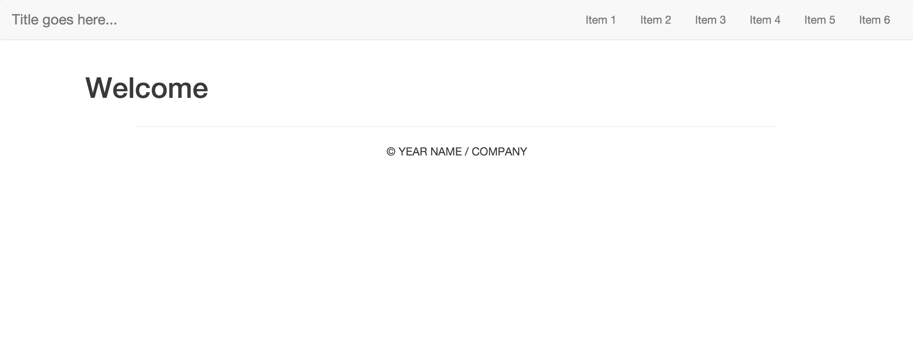

# PHP-Template
A basic template and starting point for a PHP / Bootstrap website.



## Contents
```
├── css
│   ├── normalize.css
│   └── style.css
├── footer.php
├── functions.php
├── header.php
├── index.php
└── template.php
```

The template is built up of 3 main sections header, main and footer. The header and footer sections are included files referencing header.php and footer.php respectively meaning that they only need altering once to apply across all the pages.

The functions.php file is another linked file for storing all the functions allowing access to them from the other pages.

The pages created use [Normalize.css](https://necolas.github.io/normalize.css/) and [Bootstrap](http://getbootstrap.com/).

## Getting started

To get started a few sections of the code need to be edited:
* Page title (in header.php)
* Navbar title (in header.php)
* Navbar items / links (in header.php)
* Year and name / company (in footer.php)

